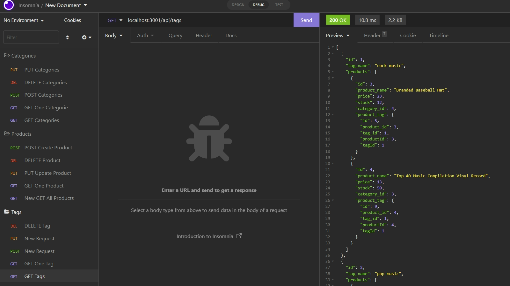
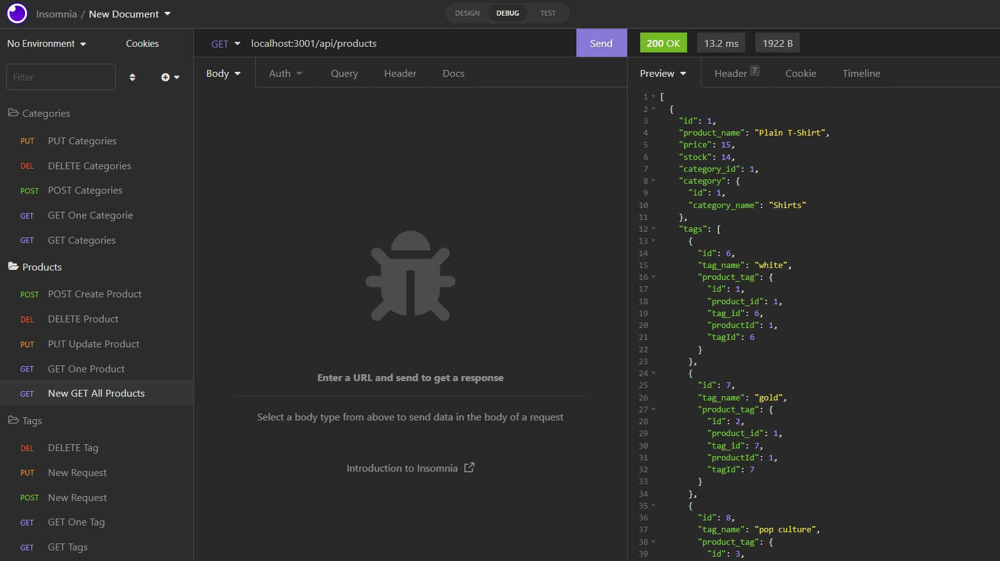
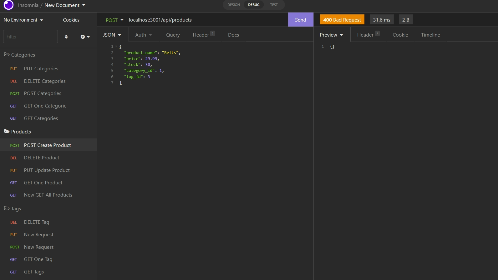

# E-Commerce Back End

## Table-of-Contents

- [Description](#description)
- [Installation](#installation)
- [Usage](#usage)
- [Contributing](#contributing)
- [Tests](#tests)
- [License](#license)
- [Questions](#questions)

## [Description](#table-of-contents)

This is a back end application for an e-commerce website, utilizing mysql2, sequelize, express, dotenv and nodemon. 

## [Installation](#table-of-contents)

A user must clone this repository and make sure they have installed Node.js on their computer. Also, the user will want to download Insomnia on their computer to utilize the database. Once cloned and installed, the user will be required to install the mysql2, sequelize, express, nodemon and dotenv modules by typing `npm install` in their terminal. Users will also be required to log into MySQL from the command line, preferably in a second terminal window using `mysql -u root -p` and typing in password immidately after. Finally, the user will `drop`, `create` and `use` the `ecommerce_db`.

## [Usage](#table-of-contents)

From the command line in the terminal, a user can type `npm run seed` to seed the database and then type `npm start` to run the server. Once the server is up, the user can open Insomnia to use the E-Commerce application Back End. 

### **Click on the following link to view the video demonstration:**
https://drive.google.com/file/d/1s2IjdP7xDDXGlbwx46N-ylASt6VfnoIW/view

### **Screenshot of the E-Commerce Back End from Insomnia:**

## [Contributing](#table-of-contents)

Contributors can see installation instructions or contact me with the information below.

## [Tests](#table-of-contents)

There are no tests for this application.

## [License](#table-of-contents)

## [Questions](#table-of-contents)

If you have any questions about this project, please contact me using the following links:

[GitHub](https://github.com/Gregm316)

[Email: gregm316@gmail.com](mailto:gregm316@gmail.com)
